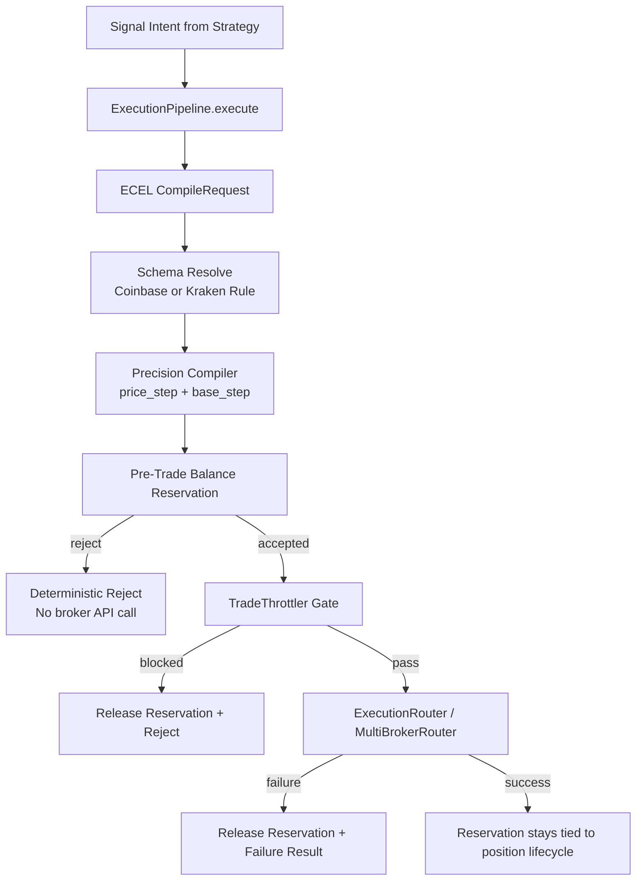

# NIJA Execution Compiler v3 (ECEL)

This document defines the ECEL architecture requested for NIJA.

## 1) Full Kraken + Coinbase Contract Schema Map

ECEL normalizes broker contract data to one canonical model:

- broker
- symbol
- base_asset
- quote_asset
- min_notional_usd
- min_base_size
- base_step_size
- price_step_size
- base_precision
- price_precision
- max_base_size

### Canonical Map Fields by Venue

Coinbase native fields (typical product payload):

- product_id -> symbol
- base_currency -> base_asset
- quote_currency -> quote_asset
- base_min_size -> min_base_size
- base_increment -> base_step_size
- quote_increment -> price_step_size
- min_market_funds -> min_notional_usd

Kraken native fields (typical asset pair payload):

- altname/wsname -> symbol
- base -> base_asset
- quote -> quote_asset
- ordermin -> min_base_size
- lot_decimals -> base_precision
- pair_decimals -> price_precision
- costmin -> min_notional_usd

ECEL now supports two schema sources:

- Seeded defaults for deterministic startup.
- Live public endpoint refresh (auto, stale-interval based).

Live refresh is safe-fallback: network/API failures never clear existing rules.

### Live Refresh Controls

- ECEL_ENABLE_LIVE_SCHEMA_REFRESH (default: true)
- ECEL_SCHEMA_REFRESH_INTERVAL_S (default: 900)
- ECEL_SCHEMA_HTTP_TIMEOUT_S (default: 5)
- ECEL_WARM_REFRESH_ON_STARTUP (default: true, pipeline preload)
- Coinbase endpoint: <https://api.exchange.coinbase.com/products>
- Kraken endpoint: <https://api.kraken.com/0/public/AssetPairs>

### Startup Warm Refresh

When ExecutionPipeline initializes, ECEL can warm-refresh both broker schema maps
before first trade compile. This avoids first-order latency and surfaces rule-count
readiness in pipeline status.

### Background Refresh Worker

ExecutionPipeline also supports a periodic ECEL schema refresher thread with jitter
and retry backoff to maintain fresh rules even during low trade traffic.

- ECEL_BACKGROUND_REFRESH_ENABLED (default: true)
- ECEL_BACKGROUND_REFRESH_INTERVAL_S (default: 900)
- ECEL_BACKGROUND_REFRESH_JITTER_S (default: 30)
- ECEL_BACKGROUND_REFRESH_MAX_BACKOFF_S (default: 3600)

Pipeline status now includes:

- ecel.background_refresh_thread_alive
- ecel.refresh_health.last_refresh_ts
- ecel.refresh_health.last_refresh_result
- ecel.refresh_health.last_refresh_error

## 2) Pre-Trade Balance Reservation System

Before any order reaches routing/execution:

1. ECEL checks account free capital using CapitalReservationManager.
2. ECEL reserves capital with a deterministic reservation ID.
3. If routing/execution fails, ECEL auto-releases reservation.
4. If throttled before dispatch, ECEL auto-releases reservation.

Result: no overlapping capital promises, no hidden over-allocation.

## 3) Step-Size + Precision Compiler

For each order intent:

1. Enforce minimum notional: compiled_notional = max(requested_notional, min_notional)
2. Compile limit/price hint to broker price grid using price_step_size
3. Convert notional -> base size
4. Compile base size to broker lot grid using base_step_size
5. Enforce min/max base size bounds

ECEL uses deterministic Decimal rounding to avoid float drift.

## 4) Zero-Reject Architecture Diagram



## 5) Drop-In Python Refactor for Pipeline

Drop-in integration is live in the pipeline:

- Pipeline request now supports:
  - available_balance_usd
  - price_hint_usd
  - account_id
- ECEL compiles size and creates reservation before throttler/router dispatch.
- Reservation is released automatically on reject/throttle/failure.

### Example

```python
from bot.execution_pipeline import get_execution_pipeline, PipelineRequest

pipeline = get_execution_pipeline()

result = pipeline.execute(
    PipelineRequest(
        strategy="ApexTrend",
        symbol="BTC-USD",
        side="buy",
        size_usd=25.0,
        order_type="MARKET",
        preferred_broker="coinbase",
        available_balance_usd=250.0,
        price_hint_usd=62000.0,
        account_id="coinbase-main",
    )
)
```

## 6) Files Added / Updated

- Added: bot/ecel_execution_compiler.py
- Updated: bot/execution_pipeline.py
- Added: ECEL_ARCHITECTURE_V3.md
